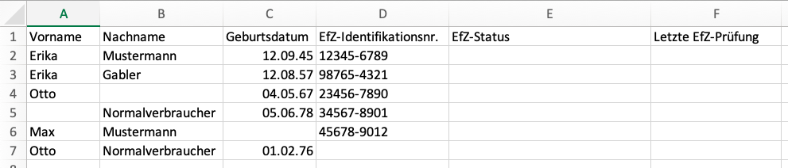
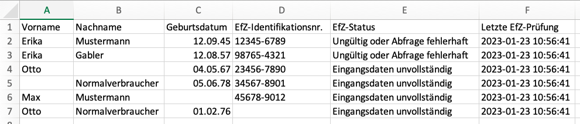
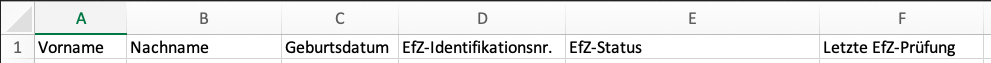
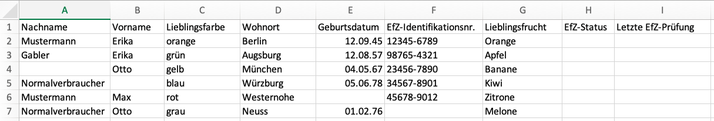
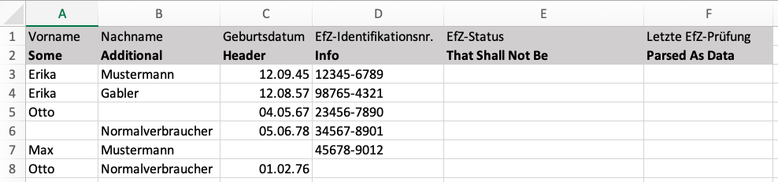
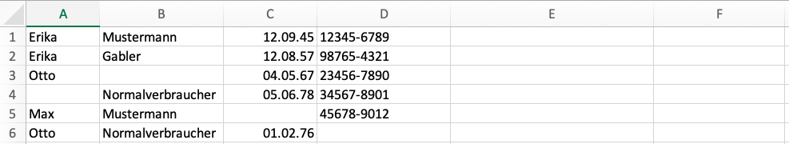

# nami-efz-check

Check of EfZ-Nachweis via [DPSG NaMi](https://nami.dpsg.de) 2.2 web interface

The Python script takes input data from an Excel spreadsheet to send HTTP requests to the official DPSG NaMi server and checks the "erweiterte Führungszeugnisse" for validity.

The inputs required to send the requests are:

* First name ("Vorname"),
* Surname ("Nachname"),
* EfZ ID ("EfZ-Nummer"; "Identifikationsnummer SGB VIII-Bescheinigung" from "Meine Bescheinigungen" inside NaMi) and
* date of birth ("Geburtsdatum").

If any item of the input data set is missing for one person, the request is skipped.

The validity status of the data set can be displayed on the command line (optional) and also be stored back in the Excel file  (optional) along with a timestamp (also optional) .

Typical use cases: check EfZ validity of members of participants of certain events.

There is a variety of command line options, e.g. to perform dry-runs or define a custom order of columns where to take the input data from.


> **Disclaimer**
> There's no warranty that this script breaks your Excel file - either by misusing it or by accident. Remember to backup your data!


# Installation

There's currently no standalone/pre-built version available.

You will need a Python 3 environment and the Python script as source code.

```
python -m venv .venv
. .venv/bin/activate
pip install -r requirements.txt
```

Ready to go...

# Usage

## tl;dr



⬇

```
python check.py test.xlsx
```

⬇



## Command line options

Call `python check.py --help` to get a detailed list of command line options:

```
usage: check.py [-h] [-c COLUMNS [COLUMNS ...]] [-n] [-dp] [-sr START_ROW] [-v] filename

check.py checks EfZ-Nachweise in DPSG NaMi 2.2 using Excel and HTTP requests

positional arguments:
  filename              path to Excel input/output file

options:
  -h, --help            show this help message and exit
  -c COLUMNS [COLUMNS ...], --columns COLUMNS [COLUMNS ...]
                        column numbers for the Excel workbook in the order Vorname (prename), Nachname (surname), Geburtsdatum (date of birth), EfZ ID (EfZ-
                        Nummer), Status and Timestamp where the first column has number 1 (not 0)
  -n, --dry-run         Dont actually send the HTTP requests to the server and dont write back to the Excel file. just parse the input data.
  -dp, --dont-print     Dont print the data on the standard output.
  -sr START_ROW, --start-row START_ROW
                        Start row (to skip parsing of header lines); the first row has number 1 (not 0).
  -v, --verbose         log level (-v: INFO, -vv: DEBUG)
```

## Options and customizations (with examples)

### Default



When not further specified, the script assumes that the **input data** is given in the default column order:

1. First name,
1. Surname,
1. EfZ ID and
1. Date of birth.

Assumes that the columns for **output data** are given in the default column order (following the columns right after the input columns):

1. Status and
1. timestamp of the check.

```
python check.py test.xls
                      ID                 Vorname             Nachname   Status
----------------------------------------------------------------------------------------------------
[2023-01-23 11:15:55] #1                   Erika           Mustermann   Ungültig oder Abfrage fehlerhaft
[2023-01-23 11:15:56] #2                   Erika               Gabler   Ungültig oder Abfrage fehlerhaft
[2023-01-23 11:15:56] #3                    Otto                        Eingangsdaten unvollständig
[2023-01-23 11:15:56] #4                            Normalverbraucher   Eingangsdaten unvollständig
[2023-01-23 11:15:56] #5                     Max           Mustermann   Eingangsdaten unvollständig
[2023-01-23 11:15:56] #6                    Otto    Normalverbraucher   Eingangsdaten unvollständig
```

### Custom column order

The default column order may not be the best fit for your input data and you may want to define your own one - but how to do it?

Let's assume your data looks like the following:



The spreadsheet has some additional columns irrelevant for the EfZ validity check itself - such as favorite color ("Lieblingsfarbe"), place of residence ("Wohnort") or favorite fruit ("Lieblingsfrucht").

We need to tell the script where to find what data. This is done by giving it the column numbers (first column has number 1, not 0) of the fields in the following order:

1. First name,
1. Surname,
1. EfZ ID,
1. Date of birth,
1. Status (optional) and
1. timestamp of the check (optional).

For the example from the screenshot:

```
python check.py test-special.xlsx --columns 2 1 6 5 8 9
```

Meaning:

* First name is taken from column #2, surname from #1, EfZ ID from #5 and date of birth from #6.
* Status will be stored in column #8.
* Timestamp will be stored in column #9.

If you're not sure about it and want to check before sending hundreds of invalid queries or breaking your Excel files: verbosity flags (limit output, add explanations) and dry-runs (suppresses requests) can help. Read on for more info.


### Custom start row

This script assumes that there is one row in the table that serves as the table's "head". Your data may have a bigger head (more than one line) or no head at all. This is why you can define a custom start row using command line parameter `--start-row` (`-sr`). Define the row number where the first row number is 1 (and not 0).

**Use case #1:** Two head rows, i.e. start row is `3`:



```
python check.py test.xls --start-row 3
```

**Use case #2:** No head rows, i.e. start row is `1`:



```
python check.py test.xls --start-row 1
```

### Verbosity

Add `-v` for additional output at log level `INFO` and `--vv` for additional log level `DEBUG`.

```
python check.py test.xls -v
```
```
python check.py test.xls -vv
```

You can provide the flag `--dont-print` (`-dp`) if the query input data and the EfZ validity status result and timestamp shall not be displayed on the standard output (and only written back to the Excel file):

```
python check.py test.xls --dont-print
```

Arbitrary combinations are allowed, e.g.:

```
check.py test.xlsx --dont-print -vv 
[   DEBUG] Processing file 'test.xlsx'
[   DEBUG] Start row: 2
[    INFO] Number of columns in workbook sheet: 6
[   DEBUG] Number of rows in workbook sheet to be processed: 7
[   DEBUG] First name is taken from column #1, surname from #2, EfZ ID from #4 and date of birth from #3.
[    INFO] Status will be stored in column #5.
[    INFO] Timestamp will be stored in column #6.
[   DEBUG] Need to store workbook after processing: True
[   DEBUG] Starting new HTTPS connection (1): nami.dpsg.de:443
[   DEBUG] https://nami.dpsg.de:443 "POST /ica/sgb-acht-bescheinigung-pruefen HTTP/1.1" 200 1010
[   DEBUG] Starting new HTTPS connection (1): nami.dpsg.de:443
[   DEBUG] https://nami.dpsg.de:443 "POST /ica/sgb-acht-bescheinigung-pruefen HTTP/1.1" 200 1011
```


### Don't write (everything) back to Excel file

Multiple use cases may exist where you do not want to write something back to the Excel file.


**Use case #1**: Perform a dry-run, just to check if the input data is okay (also does not send queries to the web server); use `--dry-run` (`-n`) flag:

```
check.py test.xlsx --dry-run
                      ID                 Vorname             Nachname   Status
----------------------------------------------------------------------------------------------------
[2023-01-23 11:24:07] #1                   Erika           Mustermann   Nicht angefragt
[2023-01-23 11:24:07] #2                   Erika               Gabler   Nicht angefragt
[2023-01-23 11:24:07] #3                    Otto                        Nicht angefragt
[2023-01-23 11:24:07] #4                            Normalverbraucher   Nicht angefragt
[2023-01-23 11:24:07] #5                     Max           Mustermann   Nicht angefragt
[2023-01-23 11:24:07] #6                    Otto    Normalverbraucher   Nicht angefragt
```


**Use case #2**: Omit storing the timestamp, only store the status: use `--columns` (`-c`) to omit the last column number for the status. For clarity of this example, the `-v` flag is used in addition:

```
check.py test.xlsx --columns 1 2 3 4 5 -v 
[    INFO] Number of columns in workbook sheet: 6
[    INFO] Status will be stored in column #5.
[    INFO] Won't store timestamp (no valid column number given).
                      ID                 Vorname             Nachname   Status
----------------------------------------------------------------------------------------------------
[2023-01-23 11:25:57] #1                   Erika           Mustermann   Ungültig oder Abfrage fehlerhaft
[2023-01-23 11:25:57] #2                   Erika               Gabler   Ungültig oder Abfrage fehlerhaft
[2023-01-23 11:25:57] #3                    Otto                        Eingangsdaten unvollständig
[2023-01-23 11:25:57] #4                            Normalverbraucher   Eingangsdaten unvollständig
[2023-01-23 11:25:57] #5                     Max           Mustermann   Eingangsdaten unvollständig
[2023-01-23 11:25:57] #6                    Otto    Normalverbraucher   Eingangsdaten unvollständig
```

**Use case #3**: Query the data from the web server but do not write back anything to the Excel source file. Again, for clarity of this example, the `-v` flag is used in addition:

```
check.py test.xlsx --columns 1 2 3 4 -v 
[    INFO] Only 4 column numbers given. Won't write back status and timestamp to Excel file (read-only).
[    INFO] Number of columns in workbook sheet: 6
[    INFO] Won't store status (no valid column number given).
[    INFO] Won't store timestamp (no valid column number given).
                      ID                 Vorname             Nachname   Status
----------------------------------------------------------------------------------------------------
[2023-01-23 11:28:59] #1                   Erika           Mustermann   Ungültig oder Abfrage fehlerhaft
...
```
